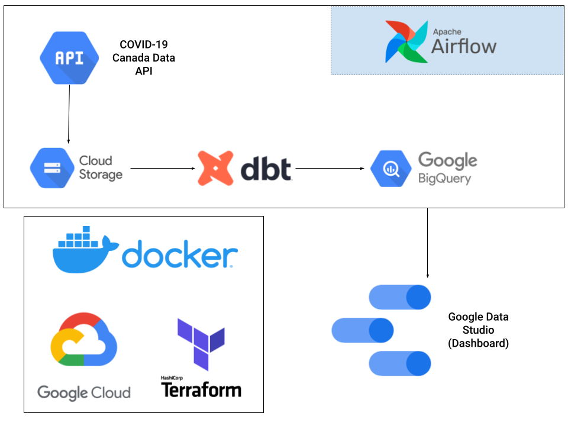
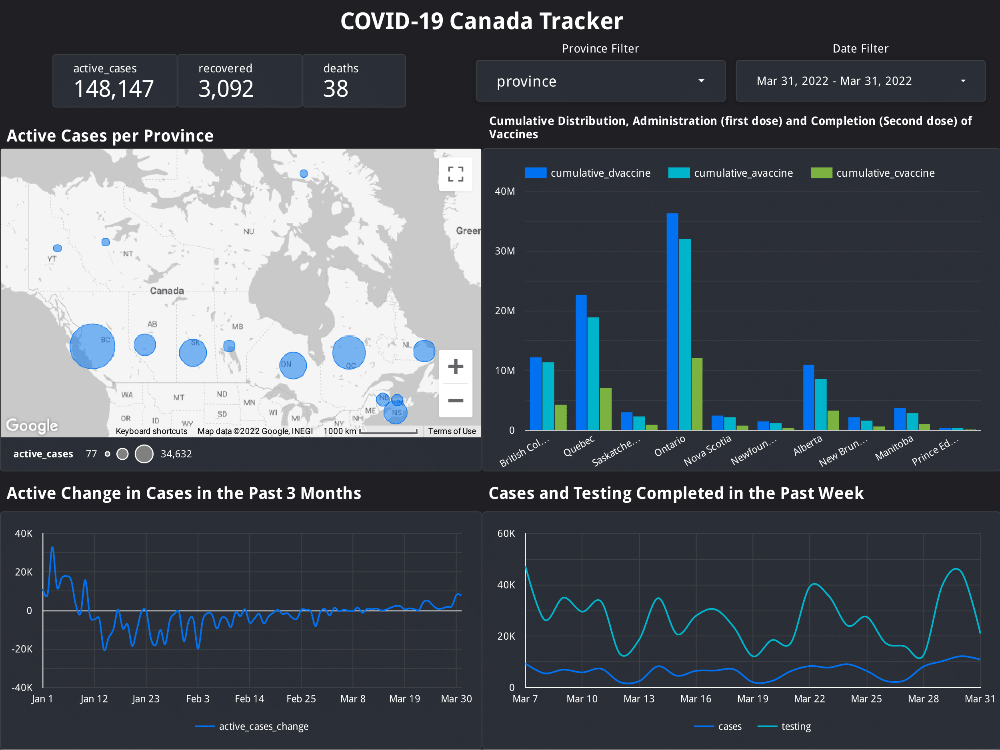

# COVID-19 Canada Tracker

A data pipeline constructed with dbt, Docker, Airflow, Terraform, and GCP.

## Overview
### Purpose
The purpose of this project is to provide a dashboard to allow users to track COVID-19 related data in Canada. The related data includes, but is not limited to, COVID-19 cases, vaccinations, deaths, and recoveries.

### Process
The data ingested through a batch job on a daily basis orchestrated through Airflow. Once ingested into a data lake (GCS), it is loaded into Bigquery where it is transformed via dbt into a clean timeseries table which is then used to create the dashboard. 

### Dataset
- Data source: Canada COVID-19 Data (https://api.opencovid.ca/)

For more information on the dataset, please refer to their git repo: https://github.com/ccodwg/Covid19Canada.

## Technical Description

### Tools and Technologies
- Cloud - Google Cloud Platform
- IaaC - Terraform
- Containerization - Docker
- Orchestration - Airflow
- Transformation - dbt
- Data Lake - Google Cloud Storage
- Data Warehouse - BigQuery
- Data Visualization - Data Studio

### Architecture

## Dashboard

## Improvements
- Create dev and prod environments
- Add tests
- Add CI/CD pipeline
